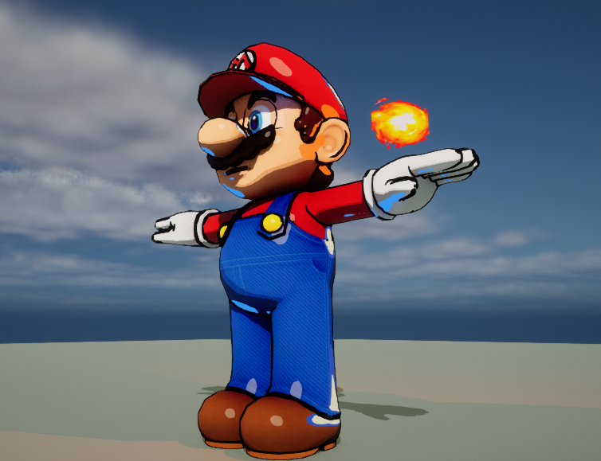

# Project L Shading Mimic

by Russell Newton

> ⚠️ DISCLAIMER: \
> This respository only contains the README of the real repository so that I can have a public repo to show off to people. \
> The actual project is located here: https://github.com/Russell-Newton/UE5.2-Project-L-Style-Mimic \
> In order to view it, you must have access to the Unreal Engine repository. Instructions to get access can be found here: https://www.unrealengine.com/en-US/ue-on-github

## Description and Goals

This is my attempt at mimicking the character shading style in the trailers and gameplay footage for Riot's upcoming
fighting game, Project L. My analysis of the footage led me to recognize a handful of critical components to the shading
via direct lighting:

* Characters are primarily lit via cel shading
* Specular highlights have hard cutoffs
* Some lights completely replace the model color with their light color (I call this pop lighting)
	* When pop lights are desaturated, they introduce a second band of color
	* Pop lights don't produce specular highlights
* Characters have black lines were edges are found, as if drawn in a comic book
	* It appears that there's some sort of detection based on world normals to get fine details

All of these features are demonstrated by the following image (© Riot Games, Inc. 2023):

Note the cel shading, particularly on their skin. Ahri's Orb of Deception acts as a pop light, highlighting her left arm
and hand with a bright blue. Noticeable on the top of Ahri's hair and Ekko's right arm and leg is a desaturated pop
light that features a blue band on the border. There seems to be a dark, purplish-grey point pop light between Ahri and
Ekko that affects her right side and his left. There aren't many specular highlights, but what highlights are there are
only present outside of pop lighting (the specular highlights on Ahri's purple belt thing don't seem to appear in the
cream-colored pop lighting).

It's worth noting that the environments do not have these sorts of effects, which I imagine is critical to keeping the
player's attention on the characters.

## Results

The following image is representative of my implementation:

While the edge highlighting isn't as crisp as Project L's, the most important part of my recreation is how the model
interacts with lights. The primary light applies a cel shading, and there are two pop lights, a blue directional light
from below and an orange point light from the fireball. Specular highlights are only present outside of the pop
lighting. The edge detection effect isn't applied to the ground plane (it would really only be applied to the border
of the plane anyways, but still it's important that the edges aren't highlighted).

For this image I used Lumen for global illumination, which is why the dark shadows are a bit noisy.

All things considered, I believe this is a fairly convincing recreation.

## Features

* A new shading model built into the engine, "Project L Shading Mimic"
* A new post process material that fills in edges on a model (only affects materials using the new shading model)
	* Contains flags to enable edge detection by scene depth, world normals, and base color and corresponding cutoffs
	* Configurable edge highlight color and width
* A new flag on all light types that turns the into pop lights (only affects materials using the new shading model)
* Configurable cutoffs for cel shading bands, specular highlights, and pop lighting area of effect, introduced as a
  LinearColorCurveAtlas made up of two curves in `/Engine/CelShading/` (although this is the default, a different atlas
  can be specified in project settings)
	* The first curve uses the dot product of the normal and light direction:
		* R = Cel shading bands
		* G = Specular bands
		* B = Pop light cutoff (acts as an opacity for the pop lighting effect)
		* A = Pop light extra band cutoff (acts as an opacity for the extra band applied on top of the primary pop
		  light)
	* The second curve uses the saturation of a pop light's color to determine properties of the extra band:
		* RGB = The color of the band
		* A = Saturation-based opacity

## Takeaways

Going into this project, I had very little familiarity with the deferred renderer in Unreal Engine. There is little to
no documentation about how to achieve something like this, and many tutorials on adding new shading models are out of
date, meaning a large portion of this project was digging through various engine files to see where something was used,
making a change, and seeing what happened. \
In doing this, I learned about how each light is rendered, how light information is passed to the GPU, and how each
light pass is used to update the SceneColor render target. I mapped out the execution flow from the
C++ `RenderLights(...)` call to the RDG adding a render pass for each light, and then within that render pass how
lighting is calculated. This will be instrumental if I ever want to make another custom shading model again. Maybe if I
try
to [properly tackle porting my final project for my GPU Programming for Video Games class](https://github.com/Russell-Newton/CS4795-Port).

All in all, I'm incredibly proud of how it turned out, especially given I started this project knowing nothing about
deferred rendering in Unreal.

## Caveats

Admittedly, I have no idea how Riot achieved what they did, particularly the pop lighting. Part of the challenge with
the deferred renderer is that each light pass adds color on top of the last pass, meaning it would normally be
impossible to completely replace the current color with the pop light color. In order to accomplish this, I changed the
pipeline blend states to mix the source (new color) and destination (old color) based on their alpha values.
Specifically, if both alphas are 0, the colors are added. If the new alpha is 1, the old color is discarded. If the old
alpha is 1, the new color is discarded. I then set the new alpha to 1 if the current pass is for a pop light.

An astute reader may see a problem here. What if two pop lights are trying to shine on the same spot? In the second
light's pass, both the old alpha and new alpha are 0, so both colors are discarded and the resulting pixel is black. I'm
not familiar enough with the blend states to try to fix this, so my solution is to simply not let two pop lights affect
the same spot. Even with this limitation, I still think the pop lighting looks great.

## References

Project L homepage: https://project-l.riotgames.com/en-us/ \
Creating a new shading
model: https://dev.epicgames.com/community/learning/tutorials/2R5x/unreal-engine-new-shading-models-and-changing-the-gbuffer \
Anime/Toon Shading Model by Envieous: https://forums.unrealengine.com/t/ue5-anime-toon-shading-model/544226 \
Unreal Engine graphics programming
documentation: https://docs.unrealengine.com/5.2/en-US/graphics-programming-for-unreal-engine/ \
Adding custom project settings: https://www.tomlooman.com/unreal-engine-developer-settings/ \
Mario fireball
image: https://www.clipartmax.com/download/m2H7N4b1Z5N4m2K9_fireball-clipart-file-super-mario-bros-fire/ \
Mario FBX: https://rigmodels.com/model.php?view=Mario-3d-model__0RJNWRF531XBTNNR38IJ74PTS

